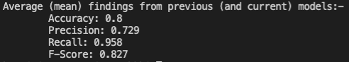

# CE314 Assignment Two Report

### by bb18960

## Text Classification

This is aided heavily by a lot of nltk (natural language toolkit - found here: https://www.nltk.org) functionality.

A NaiveBayesClassifier object is generated and trained using a subset of 90 percent of the movie_reviews corpus. It then gets tested on 10 percent of the corpus.

The test and training set gets randomised (shuffled) before the NaiveBayesClassifier gets trained and as such, we can expect different results each time the program is run.

## Pre-processing

### Removal of common first names

Movie reviews may find it necessary to use an actor's first name. A name isn't usually a positive or negative thing and as such, it's not included in this modelling. I did this because I ran an early model and noticed that the word **elliot** was a common occurrence and I found that to be pretty unnecessary.

### Stop words

A stop word is a word that helps human readability and comprehension of a sentence but is realistically often exorbitant when it comes to natural language engineering. For example, a common stop word is **the**. The sentence "the girl walked merrily along" is pretty much just as useful in the problem we face on this assignment as "girl walked merrily along". One could even argue that along is excessive.

A problem that can arise when removing stop words is that you lose context that we might not find useful for the computer to eradicate such as the popular band: 'The Beatles' returning as Beatles instead. This sort of thing would likely not cause problems in this assignment.

We remove the stop words defined at nltk.corpus.stopwords.words('english').

### Punctuation and numbers

We also need to make sure that no punctuation slips through either. That's because tone/opinion is highly complex to gauge off of punctuation in computer programming.

The same could realistically be said for most numbers. A random number appearing in an article like 3 in: "The 3 candles burn all day" asks the question - how useful is that 3? I've made the executive decision to say that it isn't useful and so all numbers get removed except if they talk about a decade ie the 90s. This is because the 90s (for example) could have connotations of "cheesy" when it comes to movies. This might indicate a negative review and as such I find it relevant to stay.

## Feature Selection

I wanted to trawl the negative reviews and find what the essence of a negative review is and the same for positive. There are certain words that lend themselves to a particularly upbeat positive position such as **outstanding** and **ground-breaking** whereas we would expect to find negative reviews to be flavoured with **rubbish** and **abysmal**.

## Evaluation

The stats that we find relevant in this project are the accuracy, precision, recall and f-measure.

### The stats

- **accuracy**
  - Finds out how often the classifier is correct in its assessment of tone (either positive or negative) based on what it actually was vs what the classifier thought it was
  - Found by passing the NaiveBayesClassifier object and the test set to nltk.classify.accuracy 
- **precision**
  - Finds out how many items were identified as relevant out of all the finds
  - Calculated by using nltk.metrics.scores.precision and passing it the positive reviews from the reference sets and the testingSets.
- **recall**
  - Fraction of how many relevant finds were made
  - Calculated by using nltk.metrics.scores.recall and passing it the positive reviews from the reference sets and the testingSets.
- **f-measure**
  - A combination of recall and precision designed to represent how much relevancy a classifier was able to achieve
  - Found by taking (2 * precision * recall) / (precision + recall)

### Analysis

At the end of each program run in **solution_bb18960.py**, a custom ResultsAnalyser object goes through all the results that have come before (and the current model) and informs the user about the mean scoring so far. On my last run we saw the following:-

